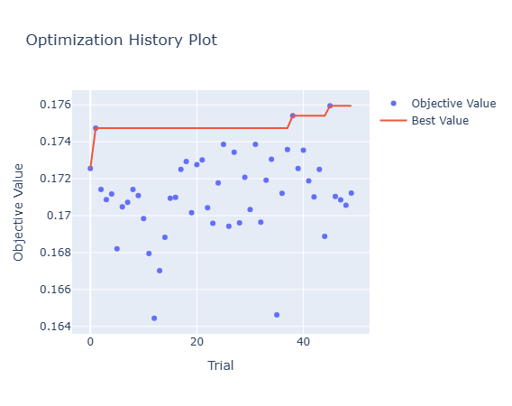
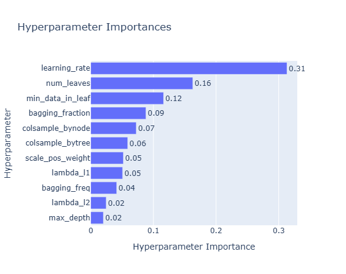
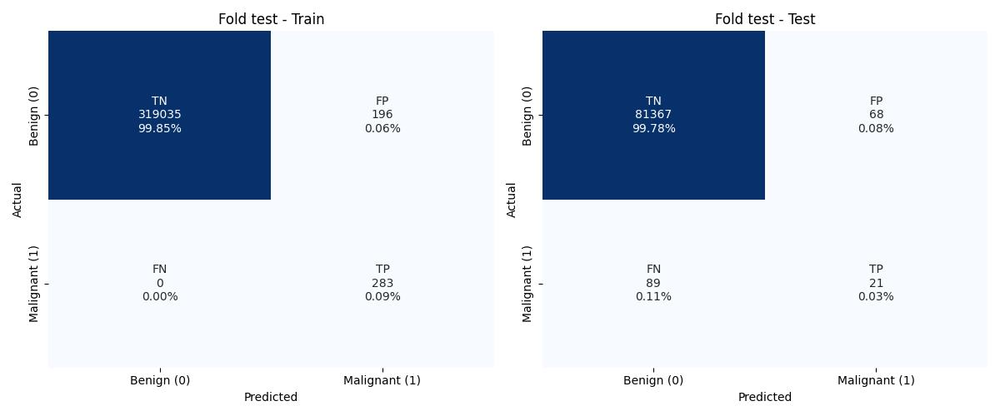
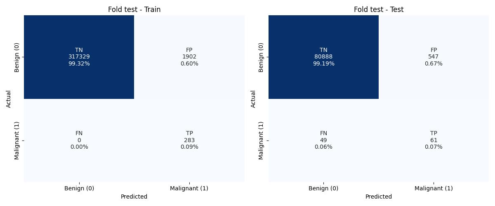

# Skin Cancer Detection


## Overview
This project is an idea from Kaggle competition **ISIC 2024 - Skin Cancer Detection with 3D-TBP**.

Images data attached to this competition consists of single-lesion crops extracted from **3D Total Body Photos (TBP)** from VECTRA WB360 by Canfield Scientific (92 cameras capturing entire skin surface).

Main task is to predict the probability that a specific lesion is **malignant (1)** or **benign (0)**.

Evaluation metric is **pAUC (Partial Area Under the ROC Curve)** specifically above an 80% **True Positive Rate (TPR)**, prioritizing high sensitivity for clinical triage.

Our project includes two approaches. First focuses on **neural networks**. TODO OSKAR

Second one is about usage of **gradient boosting** techniques with tabular data provided by kaggle in `train-metadata.csv`.

## General Data Exploration

* Dataset consists of:
    * `400666` negatives
    * `393` positives

* Patients count: `1024`

    
    

* Patients with malignant lesions count: `259`

    

* Sex

    

* Approximate age

    

* Anatomic sites

    

* Attribution

    

* Distribution of image shapes. We have randomly sampled 10000 images.

    ```txt
    Number of unique shapes: 82

    Min height: 55
    Max height: 241

    Min width: 55
    Max width: 241
    ```

    


## OSKAR TUTAJ MOŻESZ UMIEŚCIĆ SWOJE PODEJŚCIE


## Gradient Boosting Approach

### Group split (train, test)
Single patient can have multiple lesions. All images from patient x have to go into train or test, patient x cannot have lesions in both. It would be leakage.

```python
GroupShuffleSplit(n_splits=1, test_size=0.2, random_state=seed)
```
> 20% of patients go to test set

Patient (unique) counts after splitting:
* df_train: `833`
* df_test: `209`

Malignant counts after splitting:
* df_train: `283`
* df_test: `110`

### Feature Engineering
Probably the most important part.

```python
num_cols = [
    'age_approx',                        # Approximate age of patient at time of imaging.
    'clin_size_long_diam_mm',            # Maximum diameter of the lesion (mm).+
    'tbp_lv_A',                          # A inside  lesion.+
    'tbp_lv_Aext',                       # A outside lesion.+
    'tbp_lv_B',                          # B inside  lesion.+
    'tbp_lv_Bext',                       # B outside lesion.+ 
    'tbp_lv_C',                          # Chroma inside  lesion.+
    'tbp_lv_Cext',                       # Chroma outside lesion.+
    'tbp_lv_H',                          # Hue inside the lesion; calculated as the angle of A* and B* in LAB* color space. Typical values range from 25 (red) to 75 (brown).+
    'tbp_lv_Hext',                       # Hue outside lesion.+
    'tbp_lv_L',                          # L inside lesion.+
    'tbp_lv_Lext',                       # L outside lesion.+
    'tbp_lv_areaMM2',                    # Area of lesion (mm^2).+
    'tbp_lv_area_perim_ratio',           # Border jaggedness, the ratio between lesions perimeter and area. Circular lesions will have low values; irregular shaped lesions will have higher values. Values range 0-10.+
    'tbp_lv_color_std_mean',             # Color irregularity, calculated as the variance of colors within the lesion's boundary.
    'tbp_lv_deltaA',                     # Average A contrast (inside vs. outside lesion).+
    'tbp_lv_deltaB',                     # Average B contrast (inside vs. outside lesion).+
    'tbp_lv_deltaL',                     # Average L contrast (inside vs. outside lesion).+
    'tbp_lv_deltaLB',                    #
    'tbp_lv_deltaLBnorm',                # Contrast between the lesion and its immediate surrounding skin. Low contrast lesions tend to be faintly visible such as freckles; high contrast lesions tend to be those with darker pigment. Calculated as the average delta LB of the lesion relative to its immediate background in LAB* color space. Typical values range from 5.5 to 25.+
    'tbp_lv_eccentricity',               # Eccentricity.+
    'tbp_lv_minorAxisMM',                # Smallest lesion diameter (mm).+
    'tbp_lv_nevi_confidence',            # Nevus confidence score (0-100 scale) is a convolutional neural network classifier estimated probability that the lesion is a nevus. The neural network was trained on approximately 57,000 lesions that were classified and labeled by a dermatologist.+,++
    'tbp_lv_norm_border',                # Border irregularity (0-10 scale); the normalized average of border jaggedness and asymmetry.+
    'tbp_lv_norm_color',                 # Color variation (0-10 scale); the normalized average of color asymmetry and color irregularity.+
    'tbp_lv_perimeterMM',                # Perimeter of lesion (mm).+
    'tbp_lv_radial_color_std_max',       # Color asymmetry, a measure of asymmetry of the spatial distribution of color within the lesion. This score is calculated by looking at the average standard deviation in LAB* color space within concentric rings originating from the lesion center. Values range 0-10.+
    'tbp_lv_stdL',                       # Standard deviation of L inside  lesion.+
    'tbp_lv_stdLExt',                    # Standard deviation of L outside lesion.+
    'tbp_lv_symm_2axis',                 # Border asymmetry; a measure of asymmetry of the lesion's contour about an axis perpendicular to the lesion's most symmetric axis. Lesions with two axes of symmetry will therefore have low scores (more symmetric), while lesions with only one or zero axes of symmetry will have higher scores (less symmetric). This score is calculated by comparing opposite halves of the lesion contour over many degrees of rotation. The angle where the halves are most similar identifies the principal axis of symmetry, while the second axis of symmetry is perpendicular to the principal axis. Border asymmetry is reported as the asymmetry value about this second axis. Values range 0-10.+
    'tbp_lv_symm_2axis_angle',           # Lesion border asymmetry angle.+
    'tbp_lv_x',                          # X-coordinate of the lesion on 3D TBP.+
    'tbp_lv_y',                          # Y-coordinate of the lesion on 3D TBP.+
    'tbp_lv_z',                          # Z-coordinate of the lesion on 3D TBP.+
]

new_num_cols = [
    'lesion_size_ratio',             # tbp_lv_minorAxisMM      / clin_size_long_diam_mm
    'lesion_shape_index',            # tbp_lv_areaMM2          / tbp_lv_perimeterMM **2
    'hue_contrast',                  # tbp_lv_H                - tbp_lv_Hext              abs
    'luminance_contrast',            # tbp_lv_L                - tbp_lv_Lext              abs
    'lesion_color_difference',       # tbp_lv_deltaA **2       + tbp_lv_deltaB **2 + tbp_lv_deltaL **2  sqrt  
    'border_complexity',             # tbp_lv_norm_border      + tbp_lv_symm_2axis
    'color_uniformity',              # tbp_lv_color_std_mean   / tbp_lv_radial_color_std_max

    'position_distance_3d',          # tbp_lv_x **2 + tbp_lv_y **2 + tbp_lv_z **2  sqrt
    'perimeter_to_area_ratio',       # tbp_lv_perimeterMM      / tbp_lv_areaMM2
    'area_to_perimeter_ratio',       # tbp_lv_areaMM2          / tbp_lv_perimeterMM
    'lesion_visibility_score',       # tbp_lv_deltaLBnorm      + tbp_lv_norm_color
    'symmetry_border_consistency',   # tbp_lv_symm_2axis       * tbp_lv_norm_border
    'consistency_symmetry_border',   # tbp_lv_symm_2axis       * tbp_lv_norm_border / (tbp_lv_symm_2axis + tbp_lv_norm_border)

    'color_consistency',             # tbp_lv_stdL             / tbp_lv_Lext
    'consistency_color',             # tbp_lv_stdL*tbp_lv_Lext / tbp_lv_stdL + tbp_lv_Lext
    'size_age_interaction',          # clin_size_long_diam_mm  * age_approx
    'hue_color_std_interaction',     # tbp_lv_H                * tbp_lv_color_std_mean
    'lesion_severity_index',         # tbp_lv_norm_border      + tbp_lv_norm_color + tbp_lv_eccentricity / 3
    'shape_complexity_index',        # border_complexity       + lesion_shape_index
    'color_contrast_index',          # tbp_lv_deltaA + tbp_lv_deltaB + tbp_lv_deltaL + tbp_lv_deltaLBnorm

    'log_lesion_area',               # tbp_lv_areaMM2          + 1  np.log
    'normalized_lesion_size',        # clin_size_long_diam_mm  / age_approx
    'mean_hue_difference',           # tbp_lv_H                + tbp_lv_Hext    / 2
    'std_dev_contrast',              # tbp_lv_deltaA **2 + tbp_lv_deltaB **2 + tbp_lv_deltaL **2   / 3  np.sqrt
    'color_shape_composite_index',   # tbp_lv_color_std_mean   + bp_lv_area_perim_ratio + tbp_lv_symm_2axis   / 3
    'lesion_orientation_3d',         # tbp_lv_y                , tbp_lv_x  np.arctan2
    'overall_color_difference',      # tbp_lv_deltaA           + tbp_lv_deltaB + tbp_lv_deltaL   / 3

    'symmetry_perimeter_interaction',# tbp_lv_symm_2axis       * tbp_lv_perimeterMM
    'comprehensive_lesion_index',    # tbp_lv_area_perim_ratio + tbp_lv_eccentricity + bp_lv_norm_color + tbp_lv_symm_2axis   / 4
    'color_variance_ratio',          # tbp_lv_color_std_mean   / tbp_lv_stdLExt
    'border_color_interaction',      # tbp_lv_norm_border      * tbp_lv_norm_color
    'border_color_interaction_2',
    'size_color_contrast_ratio',     # clin_size_long_diam_mm  / tbp_lv_deltaLBnorm
    'age_normalized_nevi_confidence',# tbp_lv_nevi_confidence  / age_approx
    'age_normalized_nevi_confidence_2',
    'color_asymmetry_index',         # tbp_lv_symm_2axis       * tbp_lv_radial_color_std_max

    'volume_approximation_3d',       # tbp_lv_areaMM2          * sqrt(tbp_lv_x**2 + tbp_lv_y**2 + tbp_lv_z**2)
    'color_range',                   # abs(tbp_lv_L - tbp_lv_Lext) + abs(tbp_lv_A - tbp_lv_Aext) + abs(tbp_lv_B - tbp_lv_Bext)
    'shape_color_consistency',       # tbp_lv_eccentricity     * tbp_lv_color_std_mean
    'border_length_ratio',           # tbp_lv_perimeterMM      / pi * sqrt(tbp_lv_areaMM2 / pi)
    'age_size_symmetry_index',       # age_approx              * clin_size_long_diam_mm * tbp_lv_symm_2axis
    'index_age_size_symmetry',       # age_approx              * tbp_lv_areaMM2 * tbp_lv_symm_2axis
]

cat_cols = ['sex', 'anatom_site_general', 'tbp_tile_type', 'tbp_lv_location', 'tbp_lv_location_simple', 'attribution']
norm_cols = [f'{col}_patient_norm' for col in num_cols + new_num_cols]
special_cols = ['count_per_patient'] + [f'{col}_count' for col in cat_cols] + [(f'{num_col}_{cat_col}') for num_col, cat_col in itertools.product(num_cols, cat_cols)]
feature_cols = num_cols + new_num_cols + cat_cols + norm_cols + special_cols
```

### Pipeline look
Each lgb pipeline uses undersampling and tuned params. `LightGBM` creates tree **leaf-wise**. `RandomForest` creates usually **level-wise** for example.

```python
Pipeline([
    ('sampler', RandomUnderSampler(sampling_strategy=sampling_ratio, random_state=12)),
    ('classifier', lgb.LGBMClassifier(**lgb_params, random_state=12)),
])
```


### Cross-Validation using Stratified Group K-Folding
Groups are just patient_ids. This technique provides patients and classes balance across each fold.

* Patient x is never split across folds = lesions from patient x are not splitted across folds. No data leakage.
* Every fold has approximately the same percentage of 1's and 0's.
* Default threshold in predictions inside `cross_val_score` is `0.5`

```python
groups = df_train[group_col]

cv = StratifiedGroupKFold(5, shuffle=True, random_state=seed)

val_score = cross_val_score(
    estimator=estimator, 
    X=X_train, y=y_train, 
    cv=cv, 
    groups=groups,
    scoring=custom_metric,
)
```


### Diagnosed using Partial AUC
Partial AUC is our `custom_metric()`. It calculates the area under ROC curve from `0.8` tpr (recall).

So that our metric values is in range `[0.0, 0.2]`.


> On the graph there is AUC starting from 0.9 tpr.


### LightGBM Tuning using Optuna

**How it was tuned?**
50 trials, in each trial model built 200 trees (`n_iter`).

```python
def lgb_objective(trial):
    params = {
        # type of task in classification
        'objective': 'binary',

        # whether info is shown
        'verbosity': -1, 

        # number of trees in the model
        'n_iter': 200, 

        # gradient boosting decistion tree (classic boosting)
        'boosting_type': 'gbdt', 

        # regularization (Lasso), adds penalty for non-zero weights, encourage to use fewer features
        'lambda_l1': trial.suggest_float('lambda_l1', 1e-3, 10.0, log=True), 

        # (Ridge) adds penalty for large weights, encourages small, stable weights, prevents from domination of some features
        'lambda_l2': trial.suggest_float('lambda_l2', 1e-3, 10.0, log=True),

        # how much should new tree affect previous results
        'learning_rate': trial.suggest_float('learning_rate', 1e-2, 1e-1, log=True),

        # max depth of a tree
        'max_depth': trial.suggest_int('max_depth', 4, 8), 

        # num of leaves in whole model, it should be < 2**max_depth
        'num_leaves': trial.suggest_int('num_leaves', 16, 256), 

        # for each tree select only x% of features
        'colsample_bytree': trial.suggest_float('colsample_bytree', 0.4, 1.0), 

        # for each split (node) in a tree select x% of available features
        'colsample_bynode': trial.suggest_float('colsample_bynode', 0.4, 1.0), 

        # for each iteration use only x% trainig data rows
        'bagging_fraction': trial.suggest_float('bagging_fraction', 0.4, 1.0), 

        # per how many trees data should be reshuffled
        'bagging_freq': trial.suggest_int('bagging_freq', 1, 7), 

        # min num of samples required for leaf creation in a single tree
        'min_data_in_leaf': trial.suggest_int('min_data_in_leaf', 5, 100), 

        # weighting for positive class (malignant)
        'scale_pos_weight' : trial.suggest_float('scale_pos_weight', 0.8, 4.0), 
    }

    estimator = Pipeline([
        ('sampler', RandomUnderSampler(sampling_strategy=sampling_ratio)),
        ('classifier', lgb.LGBMClassifier(**params)),
    ])

    X = df_train[feature_cols]
    y = df_train[target_col]
    groups = df_train[group_col]
    cv = StratifiedGroupKFold(5, shuffle=True)

    val_score = cross_val_score(
        estimator=estimator, 
        X=X, y=y, 
        cv=cv, 
        groups=groups,
        scoring=custom_metric,
    )

    return np.mean(val_score)

study = optuna.create_study(direction='maximize')
study.optimize(lgb_objective, n_trials=50)
```

**Best params from our tuning**

Best value: `0.17595183302527378`
```python
{'lambda_l1': 0.050475696387308554,
 'lambda_l2': 0.004604923273849557,
 'learning_rate': 0.03706854419039463,
 'max_depth': 7,
 'num_leaves': 244,
 'colsample_bytree': 0.8964672653963122,
 'colsample_bynode': 0.4934008311812317,
 'bagging_fraction': 0.6447666943905135,
 'bagging_freq': 6,
 'min_data_in_leaf': 71,
 'scale_pos_weight': 1.616949356992221}
```

**Best params from kaggle**
```python
{
    'lambda_l1':        0.03335206514282942, 
    'lambda_l2':        0.005157393323802471, 
    'learning_rate':    0.030665870185795318, 
    'max_depth':        7, 
    'num_leaves':       239, 
    'colsample_bytree': 0.7573175155547233, 
    'colsample_bynode': 0.5005423904042993, 
    'bagging_fraction': 0.7937347683420382, 
    'bagging_freq':     4, 
    'min_data_in_leaf': 29, 
    'scale_pos_weight': 1.648349898918236,
}
```

**Optimization history**



**Most important params**



### Results 

**Estimator**

Our estimator is a soft `VotingClassifier` which contains 5 pipelines. 

Every pipeline includes under sampling with `sampling_ratio=0.01` and `LightGBMClassifer`.

```python
estimator = VotingClassifier([
    # x5 of them
    ('lgb1', Pipeline([
        ('sampler', RandomUnderSampler(sampling_strategy=sampling_ratio, random_state=12)),
        ('classifier', lgb.LGBMClassifier(**lgb_params, random_state=12)),
    ])),
], voting='soft')
```

**Params from kaggle**

- Test Partial AUC: `0.1709` ***Worse than ours!*** 🥳

| Precision | Recall | F1-Score |
| :--- | :--- | :--- |
| 0.2561 | 0.1909 | 0.2188 |

#### Confusion Matrix Test


**Our tuned params**

Test Partial AUC: `0.1732` 🏆

* Threshold: `0.5`

    | Precision | Recall | F1-Score |
    | :--- | :--- | :--- |
    | 0.2360 | 0.1909 | 0.2111 |

    #### Confusion Matrix Test
    

* Threshold: `0.1`

    | Precision | Recall | F1-Score |
    | :--- | :--- | :--- |
    | 0.1003 | 0.5545 | 0.1699 |

    #### Confusion Matrix Test
    

* Threshold: `0.9`

    | Precision | Recall | F1-Score |
    | :--- | :--- | :--- |
    | 0.3333 | 0.0091 | 0.0177 |

    #### Confusion Matrix Test
    


## Thanks for reading! Stay hard researchers 🦾

> Some tabular work has been done with the help of this [notebook](https://www.kaggle.com/code/greysky/isic-2024-only-tabular-data/comments?scriptVersionId=195713838). Big thank you!
