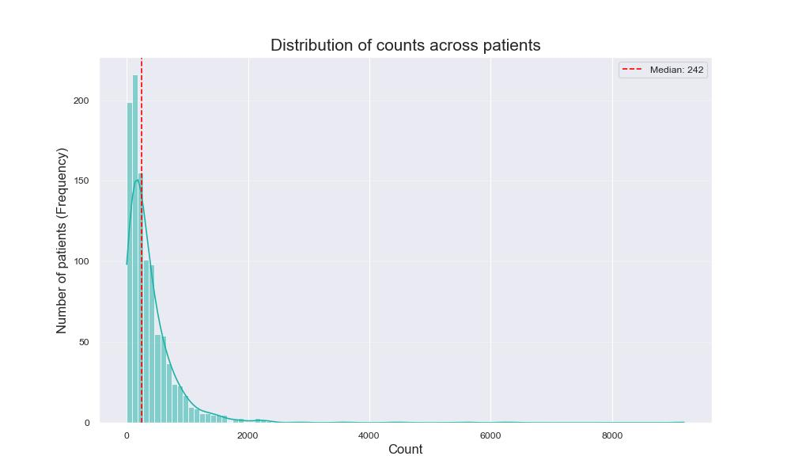
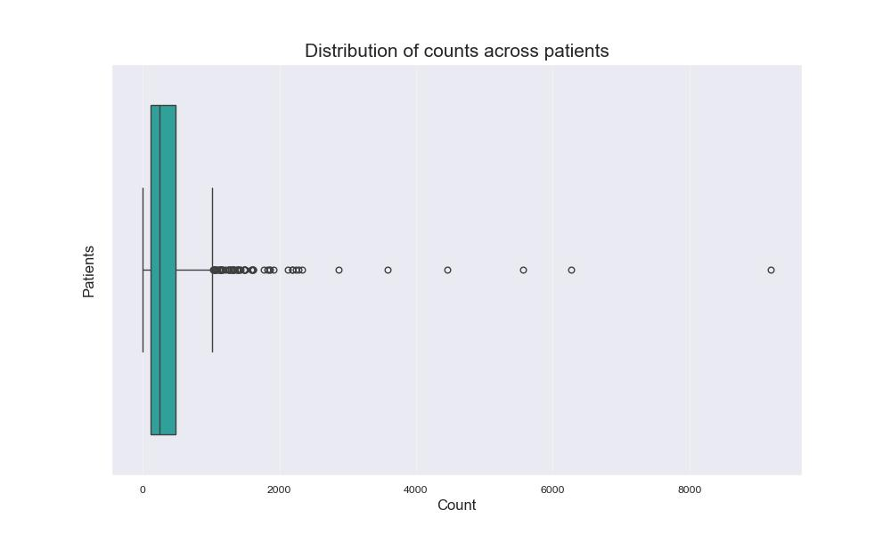
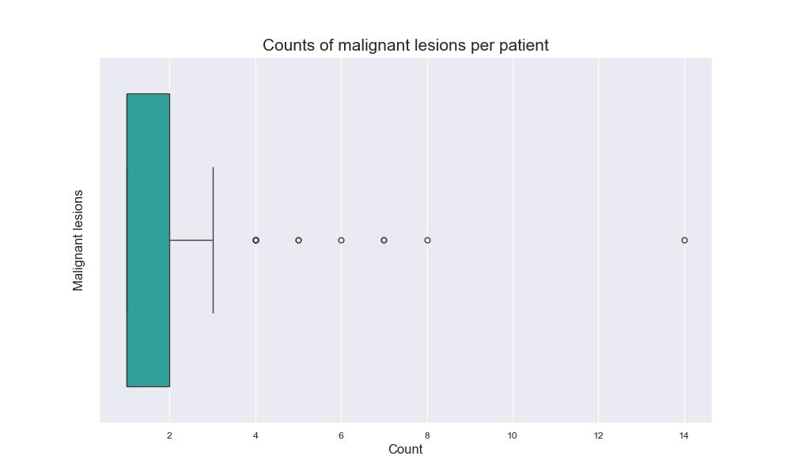
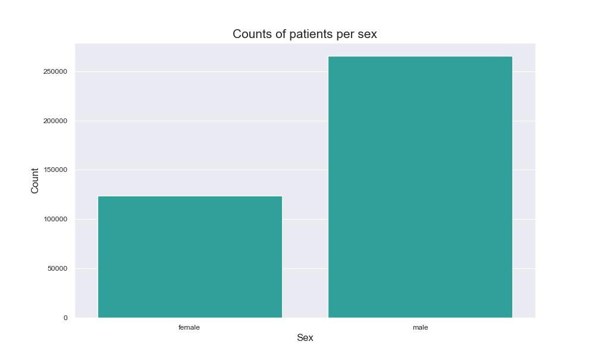
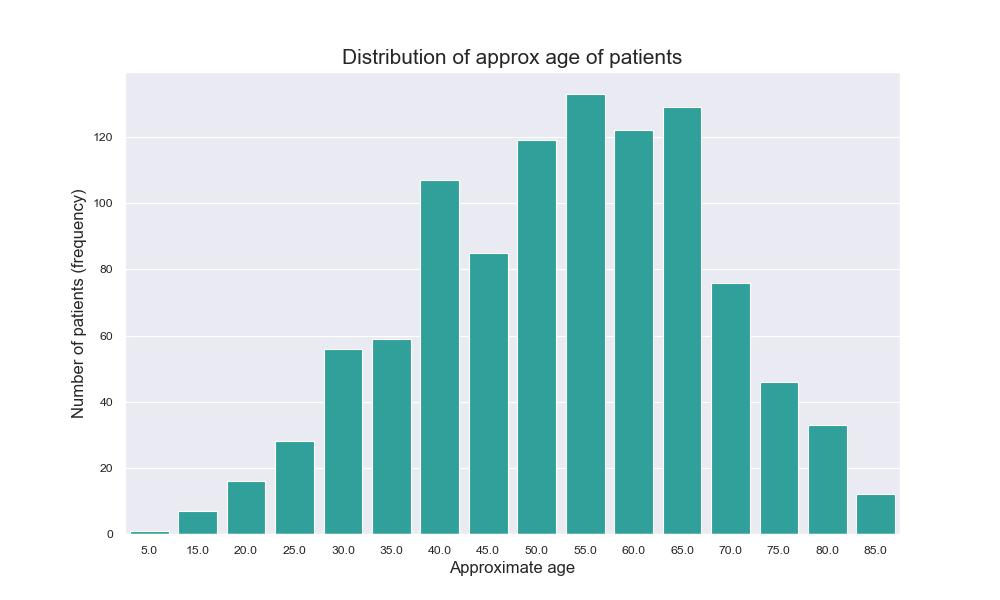
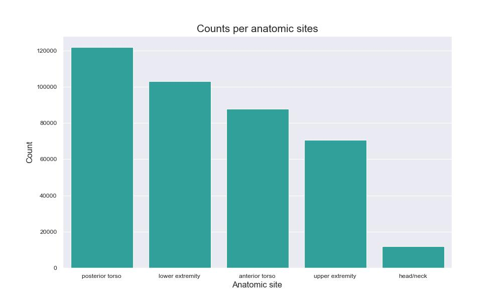
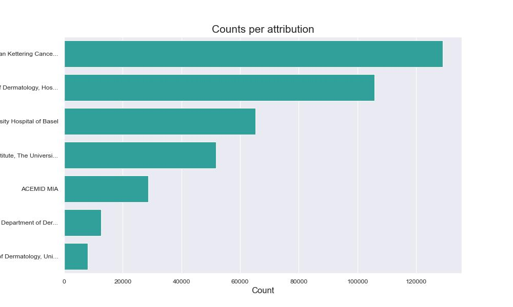
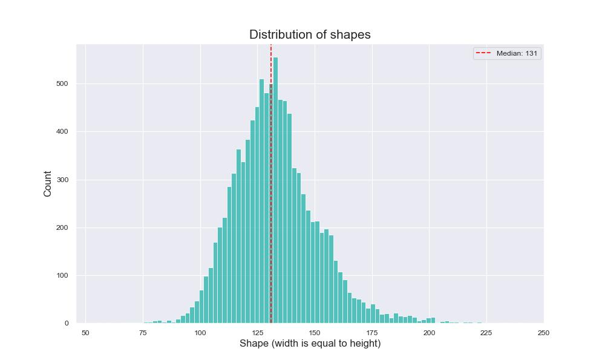

# Data analysis
* Dataset consists of:
    * `400666` negatives
    * `393` positives

* Patients count: `1024`

    
    

* Patients with malignant lesions count: `259`

    

* Sex

    

* Approximate age

    

* Anatomic sites

    

* Attribution

    

* Distribution of image shapes. We have randomly sampled 10000 images.

    ```txt
    Number of unique shapes: 82

    Min height: 55
    Max height: 241

    Min width: 55
    Max width: 241
    ```

    