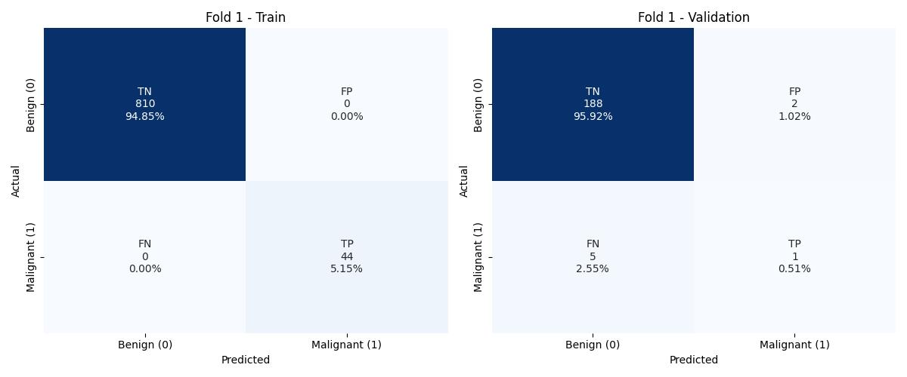
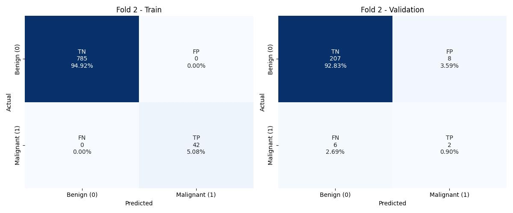
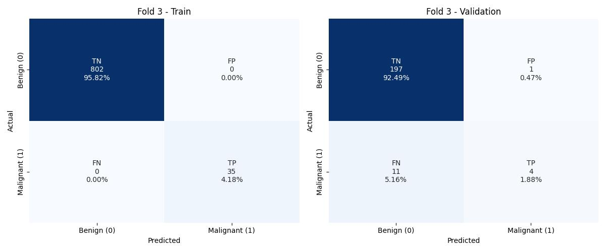
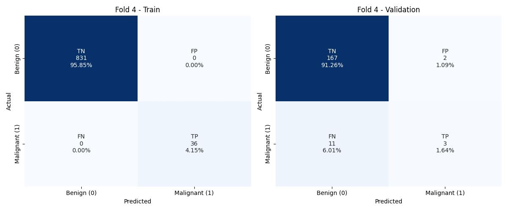
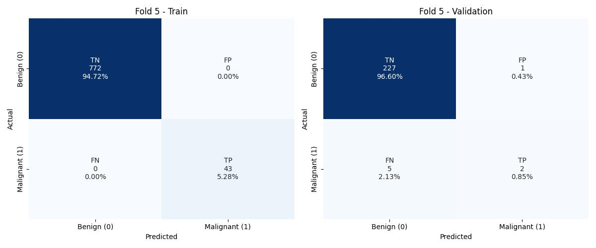
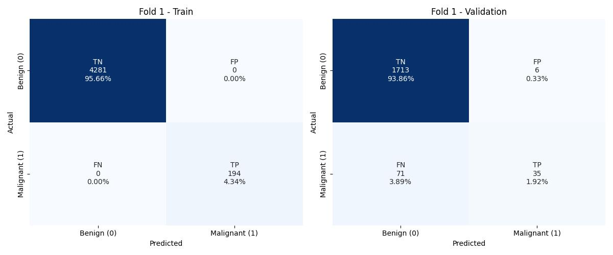
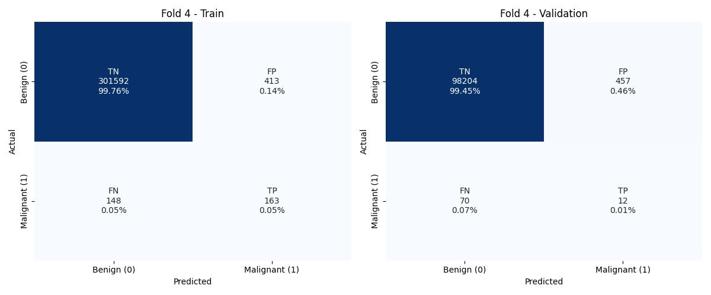
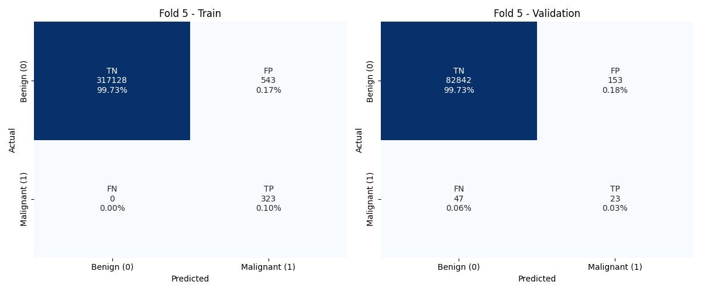
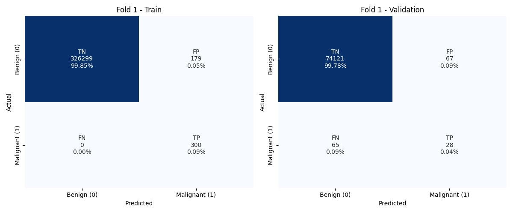

# Experiment: 0
> Initial configuration
- **Date:** 2026-01-14 20:30:54
- **Mean AUC:** `0.5481 +/- 0.0256`
- **Threshold:** `0.5`

## Model Configuration
```python
LGBMClassifier(learning_rate=0.05, objective='binary', random_state=1,
               scale_pos_weight=5, verbosity=1)
```

## Fold Results
### Fold 1
- **Fold AUC:** `0.5893`

| Class | Precision | Recall | F1-Score |
| :--- | :--- | :--- | :--- |
| 0 | 0.9990 | 0.9959 | 0.9974 |
| 1 | 0.0525 | 0.1828 | 0.0815 |

#### Confusion Matrix Fold 1


---
### Fold 2
- **Fold AUC:** `0.5096`

| Class | Precision | Recall | F1-Score |
| :--- | :--- | :--- | :--- |
| 0 | 0.9989 | 0.9957 | 0.9973 |
| 1 | 0.0060 | 0.0235 | 0.0096 |

#### Confusion Matrix Fold 2


---
### Fold 3
- **Fold AUC:** `0.5536`

| Class | Precision | Recall | F1-Score |
| :--- | :--- | :--- | :--- |
| 0 | 0.9992 | 0.9960 | 0.9976 |
| 1 | 0.0251 | 0.1111 | 0.0409 |

#### Confusion Matrix Fold 3


---
### Fold 4
- **Fold AUC:** `0.5402`

| Class | Precision | Recall | F1-Score |
| :--- | :--- | :--- | :--- |
| 0 | 0.9992 | 0.9950 | 0.9971 |
| 1 | 0.0141 | 0.0854 | 0.0241 |

#### Confusion Matrix Fold 4


---
### Fold 5
- **Fold AUC:** `0.5480`

| Class | Precision | Recall | F1-Score |
| :--- | :--- | :--- | :--- |
| 0 | 0.9992 | 0.9961 | 0.9977 |
| 1 | 0.0211 | 0.1000 | 0.0348 |

#### Confusion Matrix Fold 5


---


# Experiment: 1
> Applied RandomUnderSampler
- **Date:** 2026-01-14 20:32:56
- **Mean AUC:** `0.6621 +/- 0.0119`
- **Threshold:** `0.5`

## Model Configuration
```python
Pipeline(steps=[('sampler',
                 RandomUnderSampler(random_state=1, sampling_strategy=0.01)),
                ('classifier',
                 LGBMClassifier(learning_rate=0.05, objective='binary',
                                random_state=1, scale_pos_weight=5,
                                verbosity=1))])
```

## Fold Results
### Fold 1
- **Fold AUC:** `0.6646`

| Class | Precision | Recall | F1-Score |
| :--- | :--- | :--- | :--- |
| 0 | 0.9992 | 0.9959 | 0.9975 |
| 1 | 0.0923 | 0.3333 | 0.1445 |

#### Confusion Matrix Fold 1


---
### Fold 2
- **Fold AUC:** `0.6502`

| Class | Precision | Recall | F1-Score |
| :--- | :--- | :--- | :--- |
| 0 | 0.9992 | 0.9946 | 0.9969 |
| 1 | 0.0588 | 0.3059 | 0.0987 |

#### Confusion Matrix Fold 2


---
### Fold 3
- **Fold AUC:** `0.6799`

| Class | Precision | Recall | F1-Score |
| :--- | :--- | :--- | :--- |
| 0 | 0.9994 | 0.9947 | 0.9970 |
| 1 | 0.0597 | 0.3651 | 0.1027 |

#### Confusion Matrix Fold 3


---
### Fold 4
- **Fold AUC:** `0.6680`

| Class | Precision | Recall | F1-Score |
| :--- | :--- | :--- | :--- |
| 0 | 0.9994 | 0.9945 | 0.9970 |
| 1 | 0.0490 | 0.3415 | 0.0858 |

#### Confusion Matrix Fold 4


---
### Fold 5
- **Fold AUC:** `0.6478`

| Class | Precision | Recall | F1-Score |
| :--- | :--- | :--- | :--- |
| 0 | 0.9994 | 0.9956 | 0.9975 |
| 1 | 0.0540 | 0.3000 | 0.0915 |

#### Confusion Matrix Fold 5


---


# Experiment: 2
> Increased threshold
- **Date:** 2026-01-14 20:35:11
- **Mean AUC:** `0.6181 +/- 0.0059`
- **Threshold:** `0.7`

## Model Configuration
```python
Pipeline(steps=[('sampler',
                 RandomUnderSampler(random_state=1, sampling_strategy=0.01)),
                ('classifier',
                 LGBMClassifier(learning_rate=0.05, objective='binary',
                                random_state=1, scale_pos_weight=5,
                                verbosity=1))])
```

## Fold Results
### Fold 1
- **Fold AUC:** `0.6226`

| Class | Precision | Recall | F1-Score |
| :--- | :--- | :--- | :--- |
| 0 | 0.9991 | 0.9979 | 0.9985 |
| 1 | 0.1285 | 0.2473 | 0.1691 |

#### Confusion Matrix Fold 1


---
### Fold 2
- **Fold AUC:** `0.6105`

| Class | Precision | Recall | F1-Score |
| :--- | :--- | :--- | :--- |
| 0 | 0.9991 | 0.9976 | 0.9984 |
| 1 | 0.0922 | 0.2235 | 0.1306 |

#### Confusion Matrix Fold 2


---
### Fold 3
- **Fold AUC:** `0.6176`

| Class | Precision | Recall | F1-Score |
| :--- | :--- | :--- | :--- |
| 0 | 0.9993 | 0.9971 | 0.9982 |
| 1 | 0.0718 | 0.2381 | 0.1103 |

#### Confusion Matrix Fold 3


---
### Fold 4
- **Fold AUC:** `0.6266`

| Class | Precision | Recall | F1-Score |
| :--- | :--- | :--- | :--- |
| 0 | 0.9994 | 0.9972 | 0.9983 |
| 1 | 0.0695 | 0.2561 | 0.1094 |

#### Confusion Matrix Fold 4


---
### Fold 5
- **Fold AUC:** `0.6133`

| Class | Precision | Recall | F1-Score |
| :--- | :--- | :--- | :--- |
| 0 | 0.9993 | 0.9980 | 0.9987 |
| 1 | 0.0874 | 0.2286 | 0.1265 |

#### Confusion Matrix Fold 5


---


# Experiment: 3
> Changed training data to have 1000 0's and 50 1's
- **Date:** 2026-01-14 21:40:14
- **Mean AUC:** `0.6114 +/- 0.0222`
- **Threshold:** `0.5`

## Model Configuration
```python
LGBMClassifier(learning_rate=0.05, objective='binary', random_state=1,
               scale_pos_weight=5, verbosity=1)
```

## Fold Results
### Fold 1
- **Fold AUC:** `0.5781`

| Class | Precision | Recall | F1-Score |
| :--- | :--- | :--- | :--- |
| 0 | 0.9741 | 0.9895 | 0.9817 |
| 1 | 0.3333 | 0.1667 | 0.2222 |

#### Confusion Matrix Fold 1


---
### Fold 2
- **Fold AUC:** `0.6064`

| Class | Precision | Recall | F1-Score |
| :--- | :--- | :--- | :--- |
| 0 | 0.9718 | 0.9628 | 0.9673 |
| 1 | 0.2000 | 0.2500 | 0.2222 |

#### Confusion Matrix Fold 2


---
### Fold 3
- **Fold AUC:** `0.6308`

| Class | Precision | Recall | F1-Score |
| :--- | :--- | :--- | :--- |
| 0 | 0.9471 | 0.9949 | 0.9704 |
| 1 | 0.8000 | 0.2667 | 0.4000 |

#### Confusion Matrix Fold 3


---
### Fold 4
- **Fold AUC:** `0.6012`

| Class | Precision | Recall | F1-Score |
| :--- | :--- | :--- | :--- |
| 0 | 0.9382 | 0.9882 | 0.9625 |
| 1 | 0.6000 | 0.2143 | 0.3158 |

#### Confusion Matrix Fold 4


---
### Fold 5
- **Fold AUC:** `0.6407`

| Class | Precision | Recall | F1-Score |
| :--- | :--- | :--- | :--- |
| 0 | 0.9784 | 0.9956 | 0.9870 |
| 1 | 0.6667 | 0.2857 | 0.4000 |

#### Confusion Matrix Fold 5


---


# Experiment: 4
> scale_pos_weight 5 -> 2, train set 6000 benign, 300 malignant, folds 5 -> 3
- **Date:** 2026-01-14 21:44:38
- **Mean AUC:** `0.7074 +/- 0.0340`
- **Threshold:** `0.5`

## Model Configuration
```python
LGBMClassifier(learning_rate=0.05, objective='binary', random_state=1,
               scale_pos_weight=2, verbosity=1)
```

## Fold Results
### Fold 1
- **Fold AUC:** `0.6633`

| Class | Precision | Recall | F1-Score |
| :--- | :--- | :--- | :--- |
| 0 | 0.9602 | 0.9965 | 0.9780 |
| 1 | 0.8537 | 0.3302 | 0.4762 |

#### Confusion Matrix Fold 1


---
### Fold 2
- **Fold AUC:** `0.7127`

| Class | Precision | Recall | F1-Score |
| :--- | :--- | :--- | :--- |
| 0 | 0.9693 | 0.9930 | 0.9810 |
| 1 | 0.7742 | 0.4324 | 0.5549 |

#### Confusion Matrix Fold 2


---
### Fold 3
- **Fold AUC:** `0.7462`

| Class | Precision | Recall | F1-Score |
| :--- | :--- | :--- | :--- |
| 0 | 0.9821 | 0.9864 | 0.9842 |
| 1 | 0.5753 | 0.5060 | 0.5385 |

#### Confusion Matrix Fold 3


---


# Experiment: 5
> Added new features (feature engineering), but lgbm is without undersampling
- **Date:** 2026-01-15 21:11:10
- **Mean AUC:** `0.5625 +/- 0.0113`
- **Threshold:** `0.5`

## Model Configuration
```python
LGBMClassifier(learning_rate=0.05, objective='binary', random_state=1,
               scale_pos_weight=2, verbosity=1)
```

## Fold Results
### Fold 1
- **Fold AUC:** `0.5787`

| Class | Precision | Recall | F1-Score |
| :--- | :--- | :--- | :--- |
| 0 | 0.9989 | 0.9960 | 0.9975 |
| 1 | 0.0484 | 0.1613 | 0.0744 |

#### Confusion Matrix Fold 1


---
### Fold 2
- **Fold AUC:** `0.5624`

| Class | Precision | Recall | F1-Score |
| :--- | :--- | :--- | :--- |
| 0 | 0.9990 | 0.9953 | 0.9972 |
| 1 | 0.0298 | 0.1294 | 0.0485 |

#### Confusion Matrix Fold 2


---
### Fold 3
- **Fold AUC:** `0.5529`

| Class | Precision | Recall | F1-Score |
| :--- | :--- | :--- | :--- |
| 0 | 0.9992 | 0.9947 | 0.9970 |
| 1 | 0.0192 | 0.1111 | 0.0328 |

#### Confusion Matrix Fold 3


---
### Fold 4
- **Fold AUC:** `0.5709`

| Class | Precision | Recall | F1-Score |
| :--- | :--- | :--- | :--- |
| 0 | 0.9993 | 0.9954 | 0.9973 |
| 1 | 0.0256 | 0.1463 | 0.0436 |

#### Confusion Matrix Fold 4


---
### Fold 5
- **Fold AUC:** `0.5478`

| Class | Precision | Recall | F1-Score |
| :--- | :--- | :--- | :--- |
| 0 | 0.9992 | 0.9956 | 0.9974 |
| 1 | 0.0189 | 0.1000 | 0.0318 |

#### Confusion Matrix Fold 5


---


# Experiment: 6
> New features with undersampling
- **Date:** 2026-01-15 21:13:26
- **Mean AUC:** `0.6629 +/- 0.0347`
- **Threshold:** `0.5`

## Model Configuration
```python
Pipeline(steps=[('sampler',
                 RandomUnderSampler(random_state=1, sampling_strategy=0.01)),
                ('classifier',
                 LGBMClassifier(learning_rate=0.05, objective='binary',
                                random_state=1, scale_pos_weight=2,
                                verbosity=1))])
```

## Fold Results
### Fold 1
- **Fold AUC:** `0.7248`

| Class | Precision | Recall | F1-Score |
| :--- | :--- | :--- | :--- |
| 0 | 0.9993 | 0.9980 | 0.9987 |
| 1 | 0.2234 | 0.4516 | 0.2989 |

#### Confusion Matrix Fold 1


---
### Fold 2
- **Fold AUC:** `0.6637`

| Class | Precision | Recall | F1-Score |
| :--- | :--- | :--- | :--- |
| 0 | 0.9993 | 0.9979 | 0.9986 |
| 1 | 0.1505 | 0.3294 | 0.2066 |

#### Confusion Matrix Fold 2


---
### Fold 3
- **Fold AUC:** `0.6415`

| Class | Precision | Recall | F1-Score |
| :--- | :--- | :--- | :--- |
| 0 | 0.9993 | 0.9973 | 0.9983 |
| 1 | 0.0891 | 0.2857 | 0.1358 |

#### Confusion Matrix Fold 3


---
### Fold 4
- **Fold AUC:** `0.6213`

| Class | Precision | Recall | F1-Score |
| :--- | :--- | :--- | :--- |
| 0 | 0.9994 | 0.9986 | 0.9990 |
| 1 | 0.1266 | 0.2439 | 0.1667 |

#### Confusion Matrix Fold 4


---
### Fold 5
- **Fold AUC:** `0.6634`

| Class | Precision | Recall | F1-Score |
| :--- | :--- | :--- | :--- |
| 0 | 0.9994 | 0.9982 | 0.9988 |
| 1 | 0.1307 | 0.3286 | 0.1870 |

#### Confusion Matrix Fold 5


---


# Experiment: 7
> Updated params
- **Date:** 2026-01-15 21:17:28
- **Mean AUC:** `0.6382 +/- 0.0164`
- **Threshold:** `0.5`

## Model Configuration
```python
Pipeline(steps=[('sampler',
                 RandomUnderSampler(random_state=1, sampling_strategy=0.01)),
                ('classifier',
                 LGBMClassifier(bagging_fraction=0.7937347683420382,
                                bagging_freq=4,
                                colsample_bynode=0.5005423904042993,
                                colsample_bytree=0.7573175155547233,
                                lambda_l1=0.03335206514282942,
                                lambda_l2=0.005157393323802471,
                                learning_rate=0.030665870185795318, max_depth=7,
                                min_data_in_leaf=29, n_iter=200, n_jobs=2,
                                num_leaves=239, objective='binary',
                                random_state=1,
                                scale_pos_weight=1.648349898918236,
                                verbosity=-1))])
```

## Fold Results
### Fold 1
- **Fold AUC:** `0.6500`

| Class | Precision | Recall | F1-Score |
| :--- | :--- | :--- | :--- |
| 0 | 0.9991 | 0.9990 | 0.9991 |
| 1 | 0.2718 | 0.3011 | 0.2857 |

#### Confusion Matrix Fold 1


---
### Fold 2
- **Fold AUC:** `0.6407`

| Class | Precision | Recall | F1-Score |
| :--- | :--- | :--- | :--- |
| 0 | 0.9992 | 0.9990 | 0.9991 |
| 1 | 0.2376 | 0.2824 | 0.2581 |

#### Confusion Matrix Fold 2


---
### Fold 3
- **Fold AUC:** `0.6342`

| Class | Precision | Recall | F1-Score |
| :--- | :--- | :--- | :--- |
| 0 | 0.9993 | 0.9986 | 0.9990 |
| 1 | 0.1518 | 0.2698 | 0.1943 |

#### Confusion Matrix Fold 3


---
### Fold 4
- **Fold AUC:** `0.6094`

| Class | Precision | Recall | F1-Score |
| :--- | :--- | :--- | :--- |
| 0 | 0.9994 | 0.9992 | 0.9993 |
| 1 | 0.1915 | 0.2195 | 0.2045 |

#### Confusion Matrix Fold 4


---
### Fold 5
- **Fold AUC:** `0.6568`

| Class | Precision | Recall | F1-Score |
| :--- | :--- | :--- | :--- |
| 0 | 0.9994 | 0.9993 | 0.9993 |
| 1 | 0.2619 | 0.3143 | 0.2857 |

#### Confusion Matrix Fold 5


---


# Experiment: 8
> Changed threshold to 0.2
- **Date:** 2026-01-15 21:21:51
- **Mean AUC:** `0.7015 +/- 0.0334`
- **Threshold:** `0.2`

## Model Configuration
```python
Pipeline(steps=[('sampler',
                 RandomUnderSampler(random_state=1, sampling_strategy=0.01)),
                ('classifier',
                 LGBMClassifier(bagging_fraction=0.7937347683420382,
                                bagging_freq=4,
                                colsample_bynode=0.5005423904042993,
                                colsample_bytree=0.7573175155547233,
                                lambda_l1=0.03335206514282942,
                                lambda_l2=0.005157393323802471,
                                learning_rate=0.030665870185795318, max_depth=7,
                                min_data_in_leaf=29, n_iter=200, n_jobs=2,
                                num_leaves=239, objective='binary',
                                random_state=1,
                                scale_pos_weight=1.648349898918236,
                                verbosity=-1))])
```

## Fold Results
### Fold 1
- **Fold AUC:** `0.7564`

| Class | Precision | Recall | F1-Score |
| :--- | :--- | :--- | :--- |
| 0 | 0.9994 | 0.9967 | 0.9981 |
| 1 | 0.1655 | 0.5161 | 0.2507 |

#### Confusion Matrix Fold 1


---
### Fold 2
- **Fold AUC:** `0.7042`

| Class | Precision | Recall | F1-Score |
| :--- | :--- | :--- | :--- |
| 0 | 0.9993 | 0.9967 | 0.9980 |
| 1 | 0.1224 | 0.4118 | 0.1887 |

#### Confusion Matrix Fold 2


---
### Fold 3
- **Fold AUC:** `0.6646`

| Class | Precision | Recall | F1-Score |
| :--- | :--- | :--- | :--- |
| 0 | 0.9994 | 0.9958 | 0.9976 |
| 1 | 0.0691 | 0.3333 | 0.1144 |

#### Confusion Matrix Fold 3


---
### Fold 4
- **Fold AUC:** `0.6692`

| Class | Precision | Recall | F1-Score |
| :--- | :--- | :--- | :--- |
| 0 | 0.9995 | 0.9970 | 0.9982 |
| 1 | 0.0856 | 0.3415 | 0.1369 |

#### Confusion Matrix Fold 4


---
### Fold 5
- **Fold AUC:** `0.7130`

| Class | Precision | Recall | F1-Score |
| :--- | :--- | :--- | :--- |
| 0 | 0.9995 | 0.9974 | 0.9985 |
| 1 | 0.1215 | 0.4286 | 0.1893 |

#### Confusion Matrix Fold 5


---


# Experiment: 9
> Added voting classifier with 5 lgb models with undersampling
- **Date:** 2026-01-15 21:35:19
- **Mean AUC:** `0.5426 +/- 0.0119`
- **Threshold:** `0.8`

## Model Configuration
```python
VotingClassifier(estimators=[('lgb1',
                              Pipeline(steps=[('sampler',
                                               RandomUnderSampler(random_state=12,
                                                                  sampling_strategy=0.01)),
                                              ('classifier',
                                               LGBMClassifier(bagging_fraction=0.7937347683420382,
                                                              bagging_freq=4,
                                                              colsample_bynode=0.5005423904042993,
                                                              colsample_bytree=0.7573175155547233,
                                                              lambda_l1=0.03335206514282942,
                                                              lambda_l2=0.005157393323802471,
                                                              learning_rate...
                                                              bagging_freq=4,
                                                              colsample_bynode=0.5005423904042993,
                                                              colsample_bytree=0.7573175155547233,
                                                              lambda_l1=0.03335206514282942,
                                                              lambda_l2=0.005157393323802471,
                                                              learning_rate=0.030665870185795318,
                                                              max_depth=7,
                                                              min_data_in_leaf=29,
                                                              n_iter=200,
                                                              n_jobs=2,
                                                              num_leaves=239,
                                                              objective='binary',
                                                              random_state=52,
                                                              scale_pos_weight=1.648349898918236,
                                                              verbosity=-1))]))],
                 voting='soft')
```

## Fold Results
### Fold 1
- **Fold AUC:** `0.5430`

| Class | Precision | Recall | F1-Score |
| :--- | :--- | :--- | :--- |
| 0 | 0.9989 | 0.9999 | 0.9994 |
| 1 | 0.5000 | 0.0860 | 0.1468 |

#### Confusion Matrix Fold 1


---
### Fold 2
- **Fold AUC:** `0.5529`

| Class | Precision | Recall | F1-Score |
| :--- | :--- | :--- | :--- |
| 0 | 0.9990 | 0.9998 | 0.9994 |
| 1 | 0.4091 | 0.1059 | 0.1682 |

#### Confusion Matrix Fold 2


---
### Fold 3
- **Fold AUC:** `0.5237`

| Class | Precision | Recall | F1-Score |
| :--- | :--- | :--- | :--- |
| 0 | 0.9991 | 0.9998 | 0.9995 |
| 1 | 0.2143 | 0.0476 | 0.0779 |

#### Confusion Matrix Fold 3


---
### Fold 4
- **Fold AUC:** `0.5365`

| Class | Precision | Recall | F1-Score |
| :--- | :--- | :--- | :--- |
| 0 | 0.9992 | 0.9999 | 0.9996 |
| 1 | 0.4000 | 0.0732 | 0.1237 |

#### Confusion Matrix Fold 4


---
### Fold 5
- **Fold AUC:** `0.5571`

| Class | Precision | Recall | F1-Score |
| :--- | :--- | :--- | :--- |
| 0 | 0.9993 | 0.9999 | 0.9996 |
| 1 | 0.4211 | 0.1143 | 0.1798 |

#### Confusion Matrix Fold 5


---


# Experiment: 10
> Threshold to 0.2, simpler model with undersampling, and changed y_pred to y_probs in roc_auc_curve
- **Date:** 2026-01-15 21:44:04
- **Mean AUC:** `0.9668 +/- 0.0082`
- **Threshold:** `0.2`

## Model Configuration
```python
Pipeline(steps=[('sampler',
                 RandomUnderSampler(random_state=1, sampling_strategy=0.01)),
                ('classifier',
                 LGBMClassifier(bagging_fraction=0.7937347683420382,
                                bagging_freq=4,
                                colsample_bynode=0.5005423904042993,
                                colsample_bytree=0.7573175155547233,
                                lambda_l1=0.03335206514282942,
                                lambda_l2=0.005157393323802471,
                                learning_rate=0.030665870185795318, max_depth=7,
                                min_data_in_leaf=29, n_iter=200, n_jobs=2,
                                num_leaves=239, objective='binary',
                                random_state=1,
                                scale_pos_weight=1.648349898918236,
                                verbosity=-1))])
```

## Fold Results
### Fold 1
- **Fold AUC:** `0.9689`

| Class | Precision | Recall | F1-Score |
| :--- | :--- | :--- | :--- |
| 0 | 0.9994 | 0.9967 | 0.9981 |
| 1 | 0.1655 | 0.5161 | 0.2507 |

#### Confusion Matrix Fold 1


---
### Fold 2
- **Fold AUC:** `0.9738`

| Class | Precision | Recall | F1-Score |
| :--- | :--- | :--- | :--- |
| 0 | 0.9993 | 0.9967 | 0.9980 |
| 1 | 0.1224 | 0.4118 | 0.1887 |

#### Confusion Matrix Fold 2


---
### Fold 3
- **Fold AUC:** `0.9720`

| Class | Precision | Recall | F1-Score |
| :--- | :--- | :--- | :--- |
| 0 | 0.9994 | 0.9958 | 0.9976 |
| 1 | 0.0691 | 0.3333 | 0.1144 |

#### Confusion Matrix Fold 3


---
### Fold 4
- **Fold AUC:** `0.9683`

| Class | Precision | Recall | F1-Score |
| :--- | :--- | :--- | :--- |
| 0 | 0.9995 | 0.9970 | 0.9982 |
| 1 | 0.0856 | 0.3415 | 0.1369 |

#### Confusion Matrix Fold 4


---
### Fold 5
- **Fold AUC:** `0.9510`

| Class | Precision | Recall | F1-Score |
| :--- | :--- | :--- | :--- |
| 0 | 0.9995 | 0.9974 | 0.9985 |
| 1 | 0.1215 | 0.4286 | 0.1893 |

#### Confusion Matrix Fold 5


---


